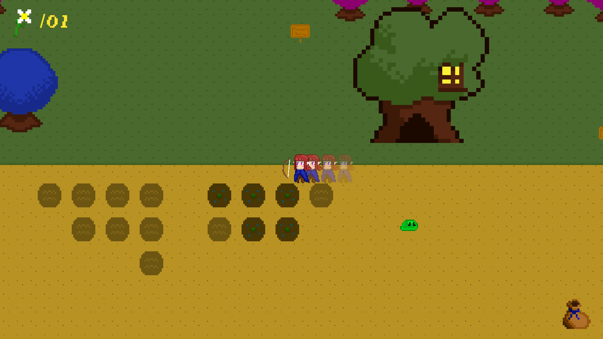
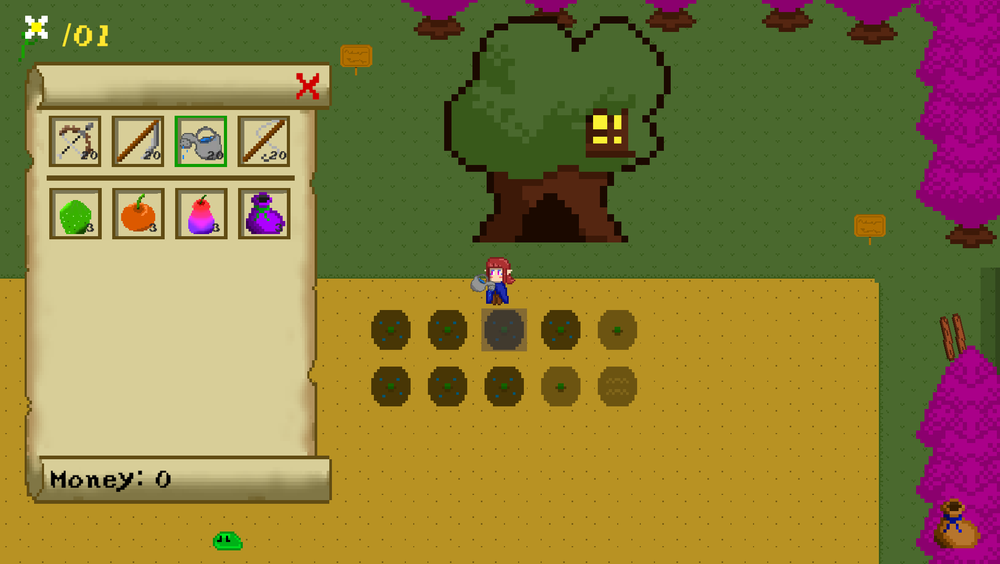
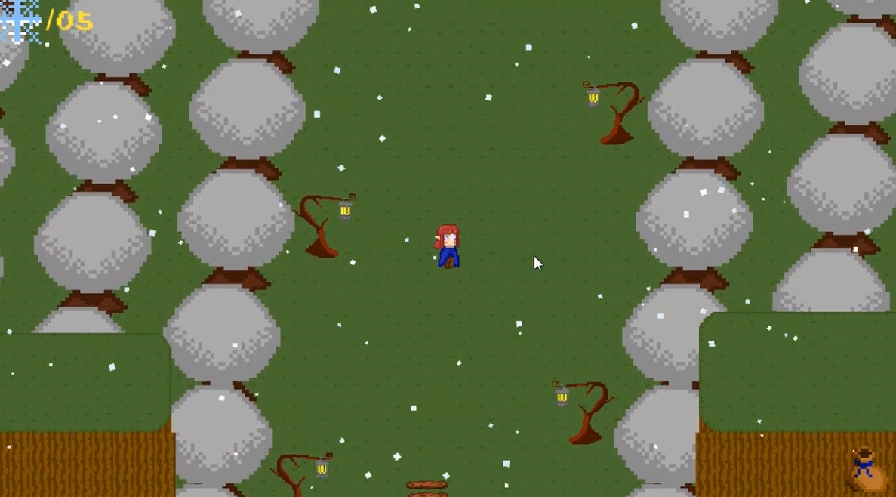

# My Elfen Garden - Cozy Game
**My Elfen Garden** is a cozy Italian game developed in Unity 2D as a final project of the second year of the Nautilus Academy - video game and digital art academy.
This is an Italian project developed in just over 4 months, and it will not be a project that will be supported or updated in the future.
  

## 🎮 Info
The player will play as a young elf who is in charge of tending her parents' farm. The entire village will be made up of children, as all the adults have left for war.
  

The player will be able to:
-Grow crops
-Go fishing
-Go hunting
-Buy and sell items at the market
-Talk to the villagers and discover the lore of the world

  
Special features:
-Day/night cycle
-Passing of seasons
-Dynamic weather

## 🎮 How to Play
1. Download the build from the [Releases]()
2. Extract the `.zip` file
3. Run the `.exe` file
4. Enjoy the game!

## 🖼️ Screenshots
  

## ⚙️ Technical Info
- Built with **Unreal Engine 5**
- Target platform: **Windows 64-bit**
- Supports: **Mouse and Keyboard**